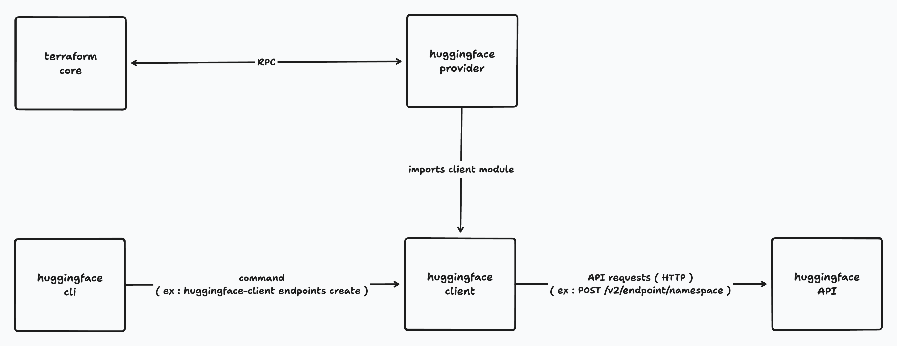

# huggingface client
A Go client wrapping api calls to the api routes provided by huggingface api and exposing them both as a library dependency and a cli. ( primarly focus on endpoints api )

## endpoints
Hugging Face dedicated endpoints are the infrastructure resources used to deploy and expose ai models as autonomous apis. More documentation available at https://huggingface.co/docs/huggingface_hub/en/package_reference/inference_endpoints.

## api url
The endpoints api is available at api.endpoints.huggingface.cloud 

### api spec 
The api specification used to implement the api was downloaded from `https://api.endpoints.huggingface.cloud`.

## api version
The version of the api specification used is 0.1.0

## library
package `client` exposes the api wrapping methods as defined in the api specification and can be imported as an external module. 

## cli
package `cmd` exposes the client methods as a cobra-based cli. It can also be installed as a standalone program using `go install github.com/sebps/huggingface-client`.

## terraform 
The api client is imported by the huggingface terraform provider and its crud methods are used to enforce the resource lifecycle of the terraform endpoints. Terraform provider available at https://github.com/sebps/terraform-provider-huggingface. You do not need to compile this package; the HuggingFace provider uses it as a dependency. 

## architecture
